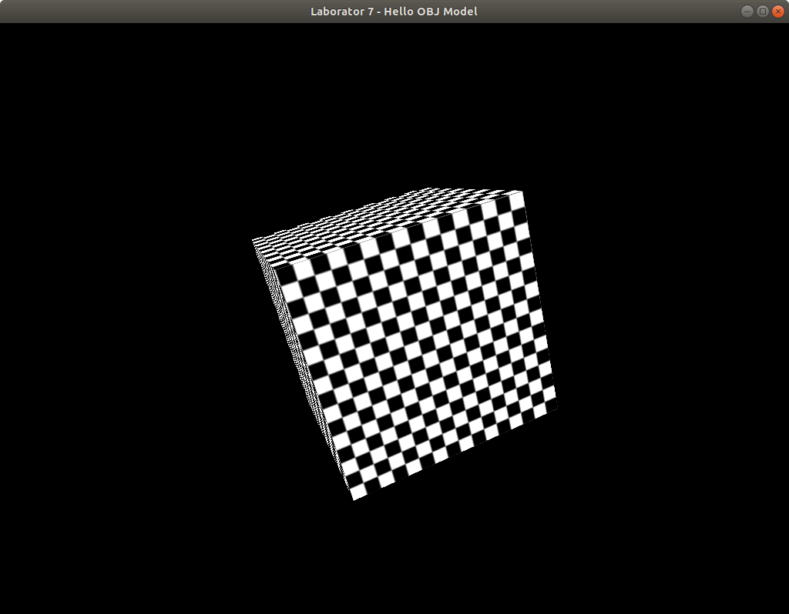

# Hello OBJ-model!

Aici folosim fișiere .obj pentru a încărca un model în scena noastră.

Din directorul laboratorului

        cd loader/
Pentru a instala dependențele în folderul local <code>node_modules</code> folosiți

        npm install
Pentru a compila

        npm run build
Această comanda va rula targetul <code>build</code> din <code>package.json</code>. Deschide <code>dist/main.html</code>. Veți obține ceva ce seamănă cu: Veți obține ceva ce seamănă cu: 

# Cerințe

1. Folosiți clasa <code>ModelImporter</code> pentru a construi o clasă <code>ImportedModel</code> similară cu clasele <code>Shere</code>.

2. Refaceți metoda <code>setupVertices</code> cu clasa creată de voi și eliminați folosirea clasei <code>ModelImporter</code> din <code>main.cpp</code>.

3. Schimbă textura și folosește Mipmaps și/sau filtre anisotrope pentru o calitate mai bună a texturii. 